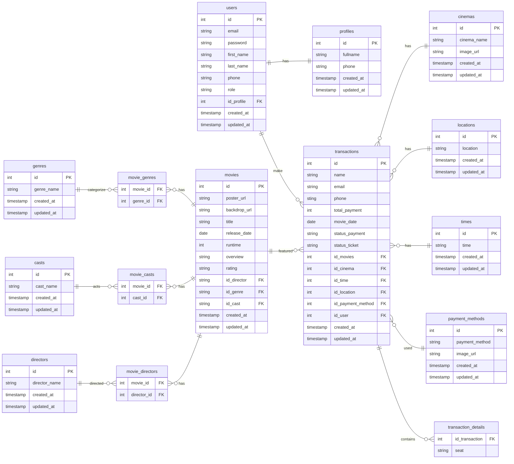

# Kukky - RESTful API Backend with NodeJS

A full-featured cinema ticket booking RESTful API built using Node.js (Express Framework), PostgreSQL as the relational database, and Redis for caching and token management. Developed as a backend system for a cinema ticket booking platform, this RESTful API handles core functionalities such as authentication, user management, movie data processing, and transaction handling, utilizing Sequelize as the ORM for database interaction.

## 🔧 Tech Stack

- Node.js with Express
- PostgreSQL (via Sequelize ORM)
- JWT for authentication
- argon2 for password encryption
- Redis for caching
- Multer for file uploads
- UUID for unique file naming
- dotenv for environment variables

## ✅ Key Features

- User registration & login with JWT & bcryptjs
- Role-based access: admin & regular user
- User management by admin
- Access and edit profile
- Admin movie management (CRUD + image upload)
- Browse all movies, now showing, and upcoming
- Manage genres, directors, and actors
- Payment method management
- Book tickets with seat, schedule, and payment method
- Middleware-based authentication & authorization

## Prerequisites

Make sure you already install Go to run this project

## How to run this project

1. Create a new empty directory for the project and navigate into it
2. Clone this project into the empty current directory:

```
git clone https://github.com/yusufbahtiarr/fgo24-node-weeklytask.git .
cd fgo24-node-weeklytask
```

3. Install dependencies

```
npm install
```

4. Create a New `.env` File and Define the Environment Variables Below:

```
APP_PORT=       # Application port

PGHOST=         # PostgreSQL host (e.g., localhost)
PGPORT=         # PostgreSQL port (default: 5432)
PGDATABASE=     # Name of the PostgreSQL database
PGUSER=         # PostgreSQL username
PGPASSWORD=     # PostgreSQL password

RDADDRESS=      # Redis server address (e.g., localhost:6379)
RDPASSWORD=     # Redis password (leave empty if none)
RDDB=           # Redis database number (usually 0)

APP_SECRET=     # Secret key used to sign JWT tokens

EMAIL_SENDER=   # Sender email address (e.g., yourapp@gmail.com)
EMAIL_PASSWORD= # Email password or App Password (use App Password for Gmail, not your main password)

```

5. Run the project

```
npm run dev
```

## Authentication

Most endpoints require a valid JWT token in the Authorization header:

```
Authorization: Bearer <your_token_here>
```

## Endpoints Overview

| Method | Endpoint                      | Description                                                   | Auth | Role       |
| ------ | ----------------------------- | ------------------------------------------------------------- | ---- | ---------- |
| POST   | /auth/register                | Create new user                                               | No   | -          |
| POST   | /auth/login                   | Login                                                         | No   | -          |
| POST   | /auth/forgot-password         | Forgot password                                               | No   | -          |
| POST   | /auth/reset-password          | Reset password                                                | No   | -          |
| GET    | /admin/movies                 | Get all movies data                                           | Yes  | Admin      |
| GET    | /admin/movies/:id             | Get one movies data                                           | Yes  | Admin      |
| POST   | /admin/movies                 | Create new movie                                              | Yes  | Admin      |
| DELETE | /admin/movies                 | Delete movie                                                  | Yes  | Admin      |
| PATCH  | /admin/movies                 | Update movie                                                  | Yes  | Admin      |
| GET    | /users/profile                | Get user's data                                               | Yes  | User/Admin |
| GET    | /users/transaction-history    | Get user's data transaction history                           | Yes  | User/Admin |
| PATCH  | /users/profile                | Update user's data                                            | Yes  | User/Admin |
| GET    | /movies                       | Get all movies data (search, filtering, sorting)              | No   | -          |
| GET    | /movies/:id                   | Get one movie data                                            | No   | -          |
| GET    | /movies/upcoming              | Get all upcoming movie                                        | No   | -          |
| GET    | /movies/now-showing           | Get all now showing movie                                     | No   | -          |
| GET    | /movies/genres                | Get all genres                                                | No   | -          |
| GET    | /movies/casts                 | Get all casts                                                 | No   | -          |
| GET    | /movies/directors             | Get all directors                                             | No   | -          |
| POST   | /transactions                 | Add new transactions                                          | Yes  | User/Admin |
| GET    | /transactions/all-transaction | Get all transactions                                          | Yes  | Admin      |
| GET    | /transactions/ticket-result   | Retrieve the latest ticket transaction for the logged-in user | Yes  | User/Admin |
| GET    | /transactions/bookedseats     | Retrieve all reserved seats for a specific showtime           | Yes  | User/Admin |
| GET    | /transactions/payment-methods | Get all payment methods                                       | Yes  | User/Admin |
| GET    | /transactions/locations       | Get all location                                              | Yes  | -          |
| GET    | /transactions/times           | Get all times                                                 | Yes  | -          |
| GET    | /transactions/cinemas         | Get all cinemas                                               | Yes  | -          |

## Entity Relational Diagram Kukky

This WeeklyTask Project, presents an Entity-Relationship Diagram (ERD) for an Kukky Booking Ticket system using the Mermaid diagramming tool.



## 📄 License

This project is licensed under the **MIT License**.

## ©️ Copyright

&copy; 2025 Kodacademy
